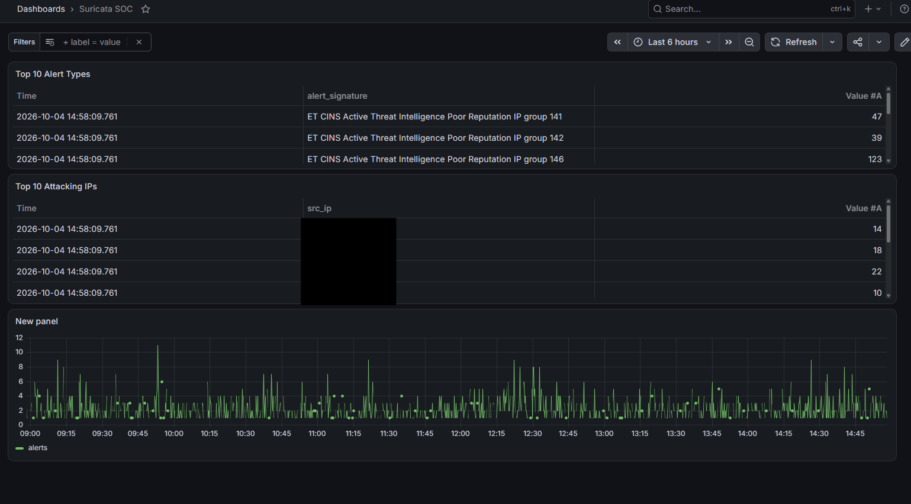
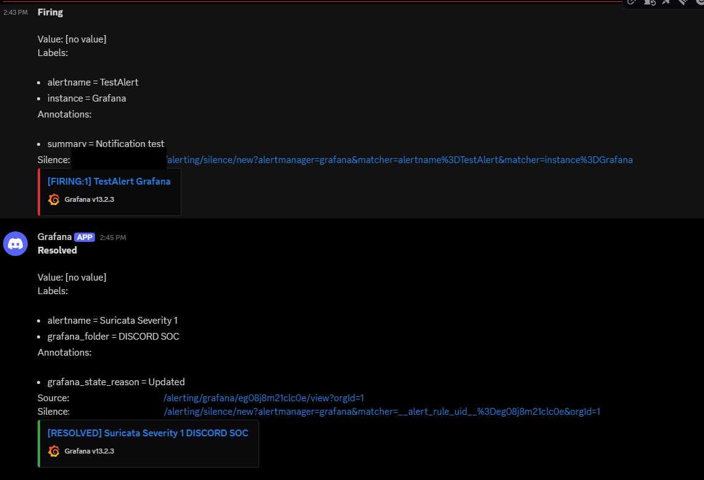

# Home Lab SOC

A small security monitoring setup I built on a single Ubuntu VM that sits on the public internet. It runs an IDS on the server's own traffic, ships the alerts into a log database, shows them on a dashboard and sends the serious ones to my phone through Discord.

I built it to learn how a SOC detection pipeline works end to end, from raw packets to an alert someone actually sees.

## Architecture

```
Internet traffic
      |
  Suricata (IDS)  -->  eve.json
      |
  Grafana Alloy  (tails the log, filters noise, adds labels)
      |
  Loki  (log storage, 7 day retention)
      |
  Grafana  (dashboard + alert rules)
      |
  Discord  (notifications)
```

Everything runs on one VM (Ubuntu 26.04, 2 vCPU, 8 GB RAM). Loki and Grafana only listen on 127.0.0.1 and I reach Grafana through an SSH tunnel, so nothing except SSH is exposed.

## What I built

**Phase 0 - Hardening**
- ufw: deny all incoming except SSH, with rate limiting on port 22
- fail2ban: SSH jail with incremental bans (1 hour, doubling up to 1 week)
- Full system update

**Phase 1 - Intrusion detection (Suricata 8)**
- Suricata in IDS mode on the server's interface, using the ET Open ruleset (~53k rules)
- Tuned out a false positive (sid 2013504, the server's own apt traffic)
- Rules update automatically every day with a systemd timer that reloads Suricata afterwards

**Phase 2 - Log pipeline and dashboard (Alloy, Loki, Grafana)**
- Alloy reads `eve.json`, drops high-volume event types (flow, stats, mdns) and labels events by type
- Loki stores the logs with 7 day retention
- Grafana dashboard with Top 10 alert types, Top 10 attacking IPs and alerts over time

**Phase 3 - Alerting**
- **Suricata Severity 1**: fires on any severity 1 alert, grouped by source IP and signature so the message shows who did what
- **Suricata Alert Spike**: fires when alerts go above 100 in 5 minutes
- Notifications go to a Discord channel through a webhook

## Screenshots

Dashboard (attacker IPs hidden):



Discord alert:



## Repo layout

| Folder | Contents |
|---|---|
| `suricata/` | suricata.yaml, disable.conf |
| `alloy/` | config.alloy |
| `loki/` | config.yml |
| `grafana/` | dashboard export (JSON) |
| `systemd/` | suricata-update service and timer |
| `fail2ban/` | jail.local |

IPs are replaced with `SERVER_IP` and `HOME_IP`.

## Lessons learned

- **Check the interface name.** Suricata was set to `eth0` by default but the VM's interface is `ens3`, so it captured nothing until I fixed it.
- **YAML is strict.** One stray character broke the Suricata config. Running `suricata -T` to test the config before restarting saved me more than once.
- **Promiscuous mode on a shared network.** The VM is on a shared LAN, and about 98% of the flows Suricata saw at first were other machines' traffic. Turning off promiscuous mode limited it to my own server.
- **Investigating an attacker.** I traced one IP from the dashboard: SSH brute force, flagged by ET COMPROMISED rules, and the fail2ban log showed its bans escalating from 1h to 2h to 4h. That was the first time I correlated two log sources for one incident.
- **Resource limits.** Suricata uses around 700 MB of RAM with the full ruleset, so the original 2 GB VM ran out of memory. I upgraded the RAM and tuned out noisy rules.
- **Baseline before you alert.** Before setting the spike threshold I measured 24 hours of data (median 34, max 79 alerts per 5 minutes), so 100 means something unusual is going on.
- **Test detections on purpose.** I verified the alert pipeline by triggering a known signature with curl, temporarily pointing the rule at it, then reverting.
- **Treat secrets as secrets.** I exposed a Discord webhook URL by accident, so I deleted it and made a new one. Configs in this repo were sanitized before publishing.

## Next steps

- Attack my own server in a controlled way (port scans, brute force) and check what gets detected
- Better Discord message templates
